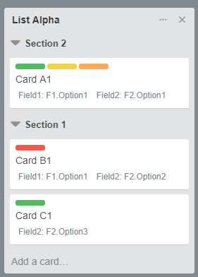
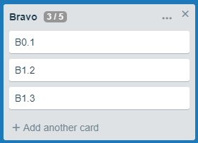
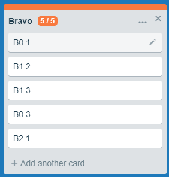
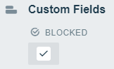
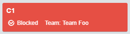

# Trello Folds <!-- omit in toc -->

**Trello Folds** is a Chrome extension making it easier to work with big boards. It also adds features needed to use Trello for **Kanban** systems.

**Trello Folds** works by scraping the Trello web page adding styling to the board. It does not exchange any data with the Trello server, Trello APIs or any other server.

Because Trello Folds relies on scraping Trello pages and applying new formatting I cannot guarantee that the extension works if Trello changes page content.

I'm working on this extension because I use the features myself, because it's fun to code, and because I like to contribute to the open source community. Feel free to use it as much as you want both for personal and commercial use.

## Table of Content <!-- omit in toc -->

- [Version History](#version-history)
- [Features](#features)
  - [Collapse Lists](#collapse-lists)
  - [List Sections](#list-sections)
  - [WiP Limits](#wip-limits)
  - [Always Count Cards](#always-count-cards)
  - [Remembering Viewstates](#remembering-viewstates)
  - [Combining Lists](#combining-lists)
  - [Blocked Cards](#blocked-cards)
  - [Comment Cards](#comment-cards)
- [Settings](#settings)
- [Troubleshooting](#troubleshooting)
  - [Q&A](#qa)

## Version History

| Version | Description                                                           |
| ------- | --------------------------------------------------------------------- |
| 0.3.1   | Fixed small bug related to combining lists. Fixed some timing issues. |
| 0.3.0   | New feature: Combining lists.                                         |
| 0.2.0   | Added option to always show card count. Other small fixes.            |
| 0.1.0   | First release.                                                        |

## Features

### Collapse Lists

With Trello Folds you can collapse lists to get more screen real estate.

Collapse a list by pressing the top right X added to the list title when running the extension.

When collapsing a list it will rotate 90 degrees. Pressing anywhere on the collapsed list will expand it to its original state.

### List Sections

List sections let you create collapsible groups inside lists. Sections are created using a special character repeated N times. The default is double hashtags (##). This can be configured in settings.

<!--

    The default character is # repeated 2 times.

 
-->
*Example*

``## Section 1``

*Adds a section called* Section 1 *to the board.*

Sections are reformatted to hide the identifier (e.g. ##). Clicking on the arrow next to the section name toggles expanding/collapsing the section.

### WiP Limits

WiP (Work in Progress) is essential to create a Kanban system. To add a WiP limit to a board add the limit inside brackets after the title.

*Example*

``List Bravo [5]``

*adds a WiP limit of 5 to* List Bravo. The title is reformatted to show the limit and also the number of cards in the list.

When the card limit is reached the limit badge is highlighted in orange and a bar is added above the list. If the limit is exceeded the badge and bar turns red. In settings you can control if you want to show the top bar or not.

Collapsing a list with a WiP limit will still show the badge and top bar (if not disabled).

**Note!** Section and comment cards (see below) are of course excluded from WiP limits.

  

### Always Count Cards

Under settings you can choose to always show the card count even if the list does not have a WiP limit.

   

### Remembering Viewstates

The extension remembers the viestate of boards. This can be enabled/disabled in settings.

### Combining Lists

You can combine two lists and give them a shared WiP limit by giving them the same prefix separated with a dot. 

*Example*

*Two adjacent lists named*

``Delta.Sub1 [5]``
``Delta.Sub2``

*will be combined into one list with two columns. The WiP limit from the leftmost list is used.*

   
   
   
   

### Blocked Cards

Using the Trello powerup *custom fields* and adding a checkbox field **Blocked** you can highlight blocked cards in the board.

  

### Comment Cards

You can add comments, descriptions, Defintion of Dones, etc. to the board by prefixing
card title with //. The card will be reformatted and excluded from WiP limits.

## Settings

Clicking the extension icon in the menu bar opens a popup window with settings.

| Setting            | Description                                                                                                                                                      |
| ------------------ | ---------------------------------------------------------------------------------------------------------------------------------------------------------------- |
| Sections           | Here you can choose a character to use for sections and how many times the character needs to be repeated.                                                       |
| WiP Limits         | Here you decide if you want the extra top bar to indicate when WiP limits are reached/exceeded.                                                                  |
| Always count cards | Toggle if card count badge should be displayed for lists without WiP limits.                                                                                     |
| Combining lists    | Turn combining lists on/off.                                                                                                                                     |
| View State         | Toggle if list view states should be remembered. Here you can also dump view states to the dev console (F12) and see for how many boards view states are stored. |

## Troubleshooting

When filing a bug please include as much information as possible.

In Chrome you can press F12 to open the JavaScript console. When the extension loads it will output some information that might give valuable clues. Please include any non-confidential information or refer to the output.

### Q&A

| Issue                                                      | Suggestion                                                                                                                   |
| ---------------------------------------------------------- | ---------------------------------------------------------------------------------------------------------------------------- |
| I make a change but the board does not update accordingly. | First try to simply reload the page. If that does not work file a bug report here or on the support page in Chrome Web Store |
| My view states are a mess                                  | In settings there's a button to clear view states. You can also dump the view states to the dev console (F12).               |

