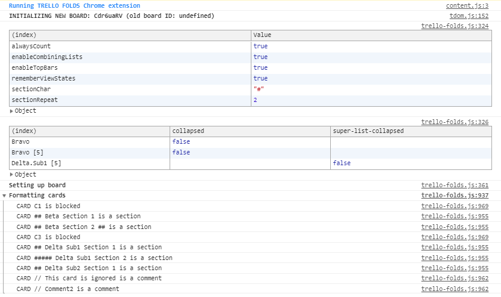

# Trello Folds <!-- omit in toc -->

**Trello Folds** is a Chrome extension making it easier to work with big boards. It also adds features needed to use Trello for **Kanban** systems.

**Trello Folds** works by scraping the Trello web page adding styling to the board. It does not exchange any data with the Trello server, Trello APIs or any other server.

Visit the [home page](https://nordmagnus.github.io/Trello-Folds/) for more information.

---

**Because Trello Folds relies on scraping Trello pages and applying new formatting I cannot guarantee that the extension works if Trello changes page content.**

---

I'm working on this extension because I use the features myself, because it's fun to code, and because I like to contribute to the open source community. Feel free to use it as much as you want both for personal and commercial use.

## Table of Content <!-- omit in toc -->

- [Version History](#version-history)
- [Installation Instructions](#installation-instructions)
- [Troubleshooting](#troubleshooting)
  - [Q&A](#qa)
  - [Filing Bugs](#filing-bugs)

## Version History

| Version | Description                                                           |
| ------- | --------------------------------------------------------------------- |
| 0.4.0   | Added formatting of blocked cards and comment cards. Fixed bugs.      |
| 0.3.1   | Fixed small bug related to combining lists. Fixed some timing issues. |
| 0.3.0   | New feature: Combining lists.                                         |
| 0.2.0   | Added option to always show card count. Other small fixes.            |
| 0.1.0   | First release.                                                        |

## Installation Instructions

Go to the extension's page in [Chrome Web Store](https://chrome.google.com/webstore/detail/trello-folds-kanban-for-t/egdkjinldbenhgdaodmdcdgknjnljihf) and add it to your browser.

## Troubleshooting

### Q&A

| Issue                                                      | Suggestion                                                                                                                   |
| ---------------------------------------------------------- | ---------------------------------------------------------------------------------------------------------------------------- |
| I make a change but the board does not update accordingly. | First try to simply reload the page. If that does not work file a bug report here or on the support page in Chrome Web Store |
| My view states are a mess                                  | In settings there's a button to clear view states. You can also dump the view states to the dev console (F12).               |

### Filing Bugs

You can file a bug here on GitHub or using Chrome Web Store support page.

When filing a bug please include as much information as possible.

In Chrome you can press F12 to open the JavaScript console. When the extension loads it will output some information that might give valuable clues. Please include any non-confidential information or refer to the output.

